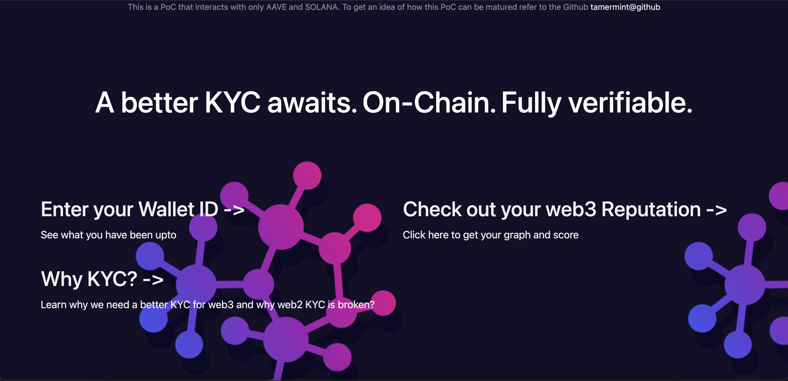

# reputation-graph

- As part of the build backdrop project to build something in Crypto and interface with backdrop partners to get it launched

- Follows a similar concept like the lens protocol however the use case is for reputation and credibility

- Output of this project : PoC of a identity network that is composable with other service providers

- What does a good identity look like? Why are government IDs acceptable forms of identification? What is wrong with Self-Sovereign Identity? I have more questions than answers at this point of the project

- One thing that is common to both identity and currency is the social acceptance of these units with an authoritative seal that demarcates the proof-of-value over random monopoly game units

- This project will also seek to solve a problem of the Consumer Layer of Crypto - the user friendly interface that is sometimes lacking in these services. To access UNISWAP for financial services or Lens for social services, maybe you are using ENS for SSO however there lies a problem of centralization when you use a name service -- unless we can interface with DDNS in general (DDNS might be a part of Web3 interoperability protocol stack)

- Reputation graph will help you import a network-graph of value from your interactions with these services which will assist you in creating use-case specific validation services

- To start : node server.js

- Live Link : https://reputation-token.onrender.com

- Additional notes:

  - This was forked off the demo react app provided by NEAR Quickstart tutorials
  - Background image - https://static.vecteezy.com/system/resources/previews/023/670/903/non_2x/decentralization-decentralized-structure-line-icon-vector.jpg

  - While this project interacts with AAVE and SOL, it is just using APIs and ABIs. No Smart Contracts are involved.

  - Anyone interested to work and develop on this can contact me directly and we can take this ahead

- Future Scope
- My plan is to iterate on this and work on cross-chain communications. I plan to use NEAR. Currently I am not using any smart contracts so that is a steep learning curve
- I need to embed and refine the quadratic scoring logic and use a smart contract for cross chain communication. Front-end can be hosted on IPFS
- Need to incorporate a decay function to gradually decay the reputation score incase of inactivity. 
- Building a client interface for B2B integrations and generate reputation tokens
- Reputation tokens : Authenticity curves based on Steganography. The token generated can have a watermark embedded inorder to have show genuine content - this is a step against deep fakes and synthetic info. At the same time need to create a light client - that only checks for authentic watermarks
